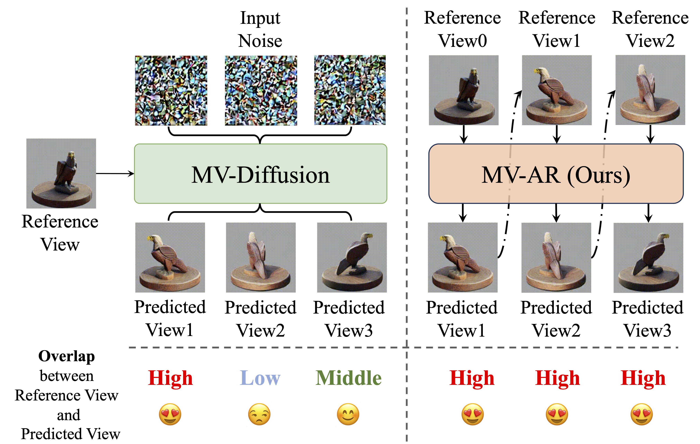
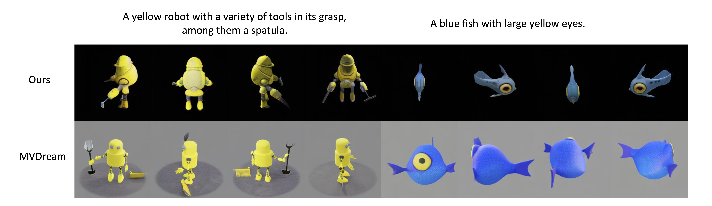

# Auto-Regressively Generating Multi-View Consistent Images

<div align="center">

[](https://arxiv.org/abs/2506.18527)&nbsp; 
[](https://huggingface.co/Jiakui/MV-AR)&nbsp; 
[](https://www.wisemodel.cn/models/jkhu29/MV-AR/file)&nbsp; 
[](https://blog.jongkhu.com/article/mvar)&nbsp; 

</div>

> [JiaKui Hu](https://jkhu29.github.io/)\*, [Yuxiao Yang](https://yuxiaoyang23.github.io/)\*, [Jialun Liu](https://scholar.google.com/citations?user=OkMMP2AAAAAJ), [Jinbo Wu](https://scholar.google.com/citations?user=9OecN2sAAAAJ), [Chen Zhao](), [Yanye Lu](https://scholar.google.com/citations?user=WSFToOMAAAAJ)
> <br>PKU, BaiduVis, THU<br>

🚀️🚀️ News:

- 2025-06-26: MV-AR is accepted by ICCV 2025 !!!
- 2025-07-26: The pretrained models of MV-AR are uploaded to [huggingface](https://huggingface.co/Jiakui/MV-AR) and [wisemodel](https://www.wisemodel.cn/models/jkhu29/MV-AR/file).

## Introduction



Diffusion-based multi-view image generation methods use a specific reference view for predicting subsequent views, which becomes problematic when overlap between the reference view and the predicted view is minimal, affecting image quality and multi-view consistency. Our MV-AR addresses this by using the preceding view with significant overlap for conditioning.

## Updates

- [x] Rendered GSO test set.
- [x] Sampling codes for text-to-multi-view and image-to-multi-view.

TODO-lists:

- [ ] Sampling codes for text-image-to-multi-view and text-shape-to-multi-view.
- [ ] Training codes.

## Results

### Text to Multiview images



### Image to Multiview images


### Text + Geometric to Multiview images


## Quick Start

### Requirements

CUDA 12.4, Pytorch >= 2.4.0

> pip install -r requirements.txt

### Reproduce

1. Please download [flan-t5-xl](https://huggingface.co/google/flan-t5-xl) in `./pretrained_models`;
2. Please download [Cap3D_automated_Objaverse_full.csv](https://huggingface.co/datasets/tiange/Cap3D/blob/main/Cap3D_automated_Objaverse_full.csv) in `dataset/captions`;
3. Please download models from [huggingface](https://huggingface.co/Jiakui/MV-AR) or [wisemodel](https://www.wisemodel.cn/models/jkhu29/MV-AR/file), put them in `./pretrained_models`;
4. Run:

```shell
# For t2mv on objaverse
sh sample_tcam2i.sh
# For t2mv on GSO
sh sample_icam2i_gso.sh
# For i2mv on GSO
sh sample_icam2i_gso.sh
```

The generated images will be saved to `samples_objaverse_nv_ray/`.

## Train

Coming soon.

## Acknowledgement

This repository is heavily based on [LlamaGen](https://github.com/FoundationVision/LlamaGen). We would like to thank the authors of this work for publicly releasing their code.

For help or issues using this git, please feel free to submit a GitHub issue.

For other communications related to this git, please contact `jkhu29@stu.pku.edu.cn`.

### Citation

```bibtex
@inproceedings{hu2025mvar,
  title={Auto-Regressively Generating Multi-View Consistent Images},
  author={Hu, JiaKui and Yang, Yuxiao and Liu, Jialun and Wu, Jinbo and Zhao, Chen and Lu, Yanye},
  booktitle={Proceedings of the IEEE/CVF International Conference on Computer Vision},
  year={2025}
}
```
